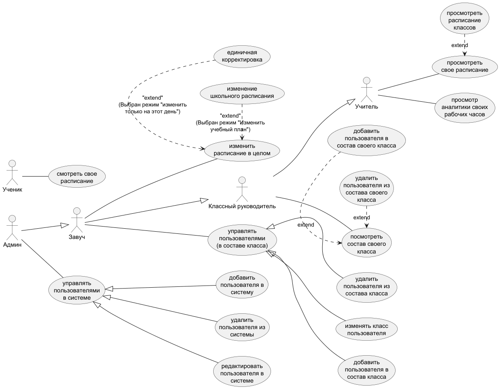
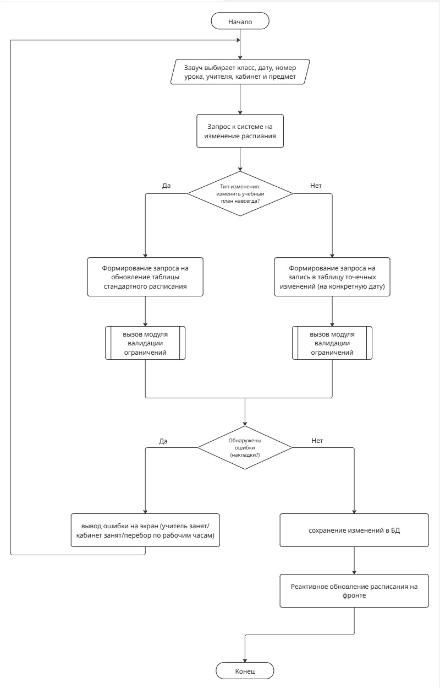
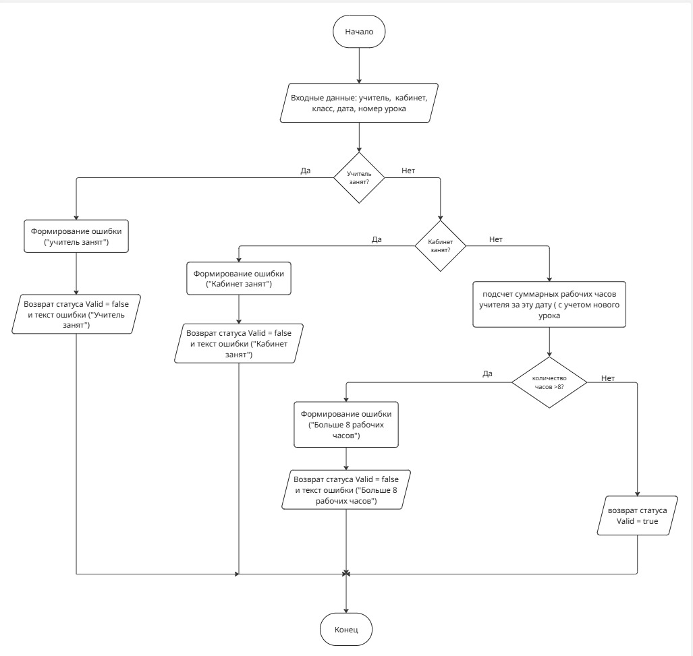

# Система автоматизации школьного расписания

## 1. Описание предметной области
Предметная область системы охватывает процессы планирования, составления, корректировки и контроля учебного времени в общеобразовательном учреждении. Система автоматизирует распределение ключевых ресурсов школы, предотвращает логистические конфликты и учитывает нормативные требования.

## 2. Цели и задачи системы
**Главная цель** — автоматизировать процесс составления школьного расписания, управлять его изменениями и исключить появление накладок (одновременные занятия в разных классах для одного учителя, пересечения по кабинетам и т.д.).

### Задачи системы:
* Автоматическая установка расписания на основе учебного плана.
* Проверка расписания на наличие конфликтов и накладок.
* Контроль выполнения учебной нагрузки (число рабочих часов преподавателей).
* Возможность вносить изменения в учебный план в целом, а также на отдельные дни (замены).

### Польза от внедрения:
* **Для администрации:** экономия десятков часов на составлении расписания, исключение человеческого фактора, быстрый подбор замен.
* **Для учителей и учеников:** доступ к актуальному расписанию без «окон».

## 3. Пользователи системы и роли

| Пользователь | Роль | Описание возможностей |
| :--- | :--- | :--- |
| **Админ** | Администратор | Полный доступ: добавление, удаление и редактирование пользователей в системе. |
| **Завуч** | Диспетчер расписания | Формирует основное расписание, утверждает замены. Управляет составом классов. |
| **Классный руководитель** | Пользователь с расширенным просмотром | Имеет доступ к составу своего класса, может добавлять и удалять из него учеников. |
| **Учитель** | Пользователь с расширенным просмотром | Просматривает личное расписание и отчет по своим рабочим часам за неделю. |
| **Ученик** | Наблюдатель | Имеет доступ только к просмотру актуального расписания и замен для своего класса. |

## 4. Список основных функций
1. **Управление справочниками:** добавление, редактирование и удаление данных об учителях, кабинетах, предметах и классах.
2. **Конструктор расписания:** интерфейс распределения уроков по дням недели с автоматической валидацией (проверка доступности кабинета и преподавателя).
3. **Изменение учебного плана:** возможность точечно менять расписание на один конкретный день или на весь учебный период.
4. **Отчетность:** генерация отчетов по преподавателям и их наработанным часам.

## 5. Архитектура и технологии
* **Backend:** Python (FastAPI) — реализация бизнес-логики и автоматической валидации ограничений.
* **Database:** SQLite — локальная СУБД, хранящаяся в одном файле.
* **ORM:** SQLAlchemy — инструмент для работы с базой данных через объекты Python.
* **Frontend:** Vue.js — клиентское веб-приложение для реактивного и динамического обновления интерфейса.

## 6. Диаграмма участников (Use-Case)

## 7. Алгоритмы работы (Блок-схемы)

### Алгоритм внесения изменений в расписание

### Модуль автоматической валидации данных

